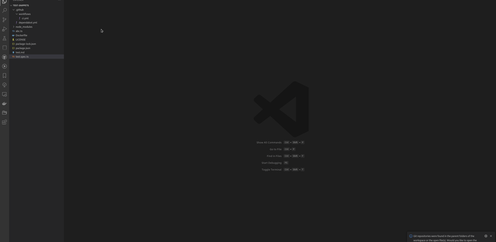

# VSCode Advanced snippets

> A better way to manage [VSCode](http://code.visualstudio.com) code snippets.

[](github.com/brpaz/vscode-advanced-snippets/actions/workflows/ci.yml)
[](https://marketplace.visualstudio.com/items?itemName=brpaz.vscode-advanced-snippets)
[](https://marketplace.visualstudio.com/items?itemName=brpaz.vscode-advanced-snippets)
[](LICENSE)


## Motivation

Snippets are a great way to be more productive and code faster. VScode built-in snippets are great, but they have some limitions, like:

- The original VSCOde JSON snippet format is hard to manage.
- There is not an interface to see all your snippets at a glance and create new ones.
- The "context" where the spinnet is applied is limited. (You can only specify spippets by language and not by file path for example. I don´t want to see `dependabot.yml` snippets, if I am not in a `dependabot.yml` file)

This extensions aims to solve this issues, and making managing snippets inside VS Code a better experience.

## Demo


## Features

- Manage snippets directly from the VSCode interface using the Explorer.
- Configure advanced conditions to trigger the snippets (Ex: File pattern, NPM Package, etc).
- Snippets are stored in a `yaml` file, by snippet, in a format similar to a Kubernetes CRD, making it a lot easier to read and edit, that the original VSCode snippets format.
- Supports dynamic variables using the same syntax as VS Code built-in snippets

## Getting started

### Installation

Launch VS Code Quick Open (`Ctrl+P`), paste the following command, and press enter.

```sh
ext install brpaz.vscode-advanced-snippets
```


## Usage

After installing this extension, a new item will be placed on your editor Activity Bar. This will provide a quick access to your snippets.


A "Default" folder will be created and you can start creating snippets right away. If your want to find your snippets in Disk, they are stored in `~/.config/Code/User/globalStorage/brpaz.vscode-advanced-snippets/snippets`.

## The anatomy of a snippet file.

Snippets are stored by default at `<extension_path>/snippets` folder and then organized by subfolders. They are displayed in a Tree View in the Activity bar, where you can get an overview of all your snippets.

A snippet file is stored with `<uuid>.snippet.yaml` filename and the structure have some similarities with a Kubernetes CRD.

Here is a full example of a snippet file:

```yaml
apiVersion: vscode-snippets.brunopaz.dev/v1
kind: Snippet
metadata:
  uid: fdba0319-da5d-476e-a670-13306cbb4825
  name: Jest Mock FS
spec:
  body: |
    jest.mock('fs', () => ({
      ...jest.requireActual('fs'),
      writeFileSync: jest.fn(),
      mkdirSync: jest.fn(),
      rmSync: jest.fn(),
      rmdirSync: jest.fn(),
      renameSync: jest.fn(),
    }));
  conditions:
    language: typescript
    file_patterns:
      - "**/*.test.ts"
      - "**/*.spec.ts"
    packages:
      - name: jest
        format: npm
```

- `uid` - Auto generated unique identifier for the snippet. this should not be edited manually and it´s used as the snippet file name as well.
- `name` - The name of the snippet. (This will be the name that will appear in both Tree View and on the Autocomplete)
- `body` - The body of the snippet. It supports [variables](https://code.visualstudio.com/docs/editor/userdefinedsnippets#_variables), in the same way as built-in VSCode snippets.
- `conditions`- A list of conditions for the snippet to be displayed. These conditions are evaluating against the current open file in the editor, when you trigger the completion.

The language identifier is the only mandatory field in the `conditions` object and should match one of the supported [language identifiers](https://code.visualstudio.com/docs/languages/identifiers#_known-language-identifiers) by VSCode. The extension will only display this snippet in files that match this language.

`file_patterns` allows to show this snippet, only if the current opened file, matches any of the specified `glob` patterns.

Finally the `packages` property, allow to display the snippet, only if the opened project contains the specified packages. Form now `npm` and `gomod` formats are supported.

### Creating a snippet

This extension have 2 different ways to create a snippet:

- Create from the existing selection. (using the "Create snippet from selection context menu") - **recommended**
- From the snippets Tree View in the Activity Bar, by right clicking on a folder.



### Inserting a snippet.

The are three different ways you can use to insert a snippet:

- On the snippet Tree view in the Activity Bar, right click on the snippet and select `Insert snippet`. This will insert the snippet contents inside the opened file in the editor. Note that it won´t apply any `conditions` this way.
- Using the Command Palette -> (`Advanced Snippets -> Search Snippets`). A list of available snippets that match the conditions based on the current opened file, will be displayed. Select an item from the results to insert.
- Using the trigger character - By default `>`, but you can change on the Extension settings. Type `>` in your file, to show the list of available snippets and press enter to insert.


## Known Issues / Limitations

- This extension does not support nested folders. I don´t think there is a critical need for it, but if you would like to have this feature, I will glad accept any PRs.
- The autocomplete is not being triggered on YAML files. This seems to be an issue with VSCode itself as the `CompletionProvider` is not even triggered. As a workaround, use `Command Palette -> Search snippets` command to insert snippets in YAML files or use the Tree View.


## Roadmap

This extension has the basic funcionality implemented. I am using it daily, and will keep identifiying points to improve.


## Contributing

Contributions are what make the open source community such an amazing place to be learn, inspire, and create. Any contributions you make are **greatly appreciated**.

1. Fork the Project
2. Create your Feature Branch (`git checkout -b feature/AmazingFeature`)
3. Commit your Changes (`git commit -m 'Add some AmazingFeature'`)
4. Push to the Branch (`git push origin feature/AmazingFeature`)
5. Open a Pull Request


## Author

👤 **Bruno Paz**

* Website: [brunopaz.dev](https://brunopaz.dev)
* Github: [@brpaz](https://github.com/brpaz)


## 💛 Support the project

If this project was useful to you in some form, I would be glad to have your support.  It will help to keep the project alive and to have more time to work on Open Source.

The sinplest form of support is to give a ⭐️ to this repo.

You can also contribute with [GitHub Sponsors](https://github.com/sponsors/brpaz).

[](https://github.com/sponsors/brpaz)


Or if you prefer a one time donation to the project, you can simple:

<a href="https://www.buymeacoffee.com/Z1Bu6asGV" target="_blank"></a>


## 📝 License


Copyright © 2023 [Bruno Paz](https://github.com/brpaz).

This project is [MIT](https://opensource.org/licenses/MIT) licensed.

<a href="https://www.flaticon.com/free-icons/coding" title="coding icons">Coding icons created by Freepik - Flaticon</a>
